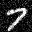

# DDPM

This is the implementation of [Denoising Diffusion Probabilistic Model](https://arxiv.org/abs/2006.11239) in PyTorch with training and inference parts from scratch.

# Quick Start
* Create a new conda environment with python 3.8 then run below commands

* git clone https://github.com/azmozaffari/ddpm.git

* cd ddpm

* pip install -r requirements.txt

* For training/inference use the below commands passing the desired configuration file as the config argument in case you want to play with it.

* python3 main.py --config "path/to/config/file" --mode training       for training ddpm

* python3 main.py --config "path/to/config/file" --mode inference      for generating images

# Results
The trained checkpoints will be saved in checkpoints folder during the training.

The generated images are saved in outcomes folder after running the inference mode.

Here are some results on MNIST dataset:

<table>
  <tr>
    <td> </td>
    <td> </td>    
    <td></td>    
    <td></td>    
    <td></td>    
    <td></td>    
    <td></td>    
    <td></td>    
    <td></td>    
    <td></td>
  </tr> 
</table>
